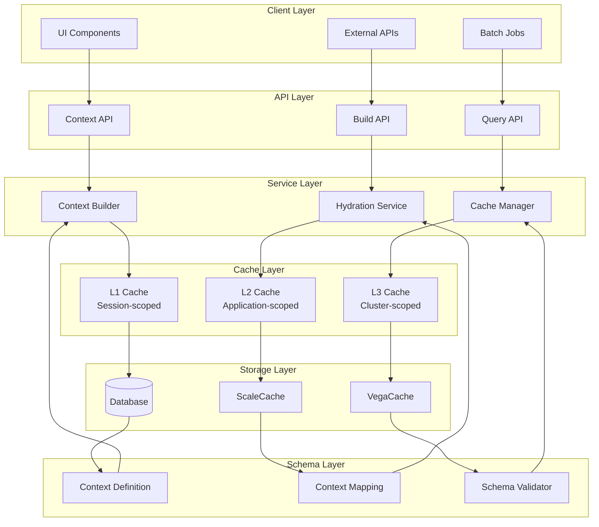
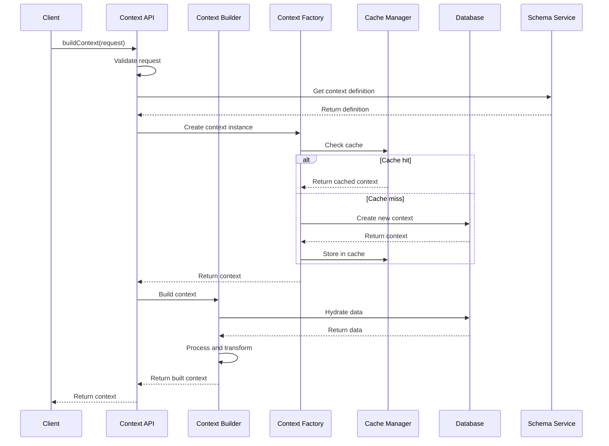
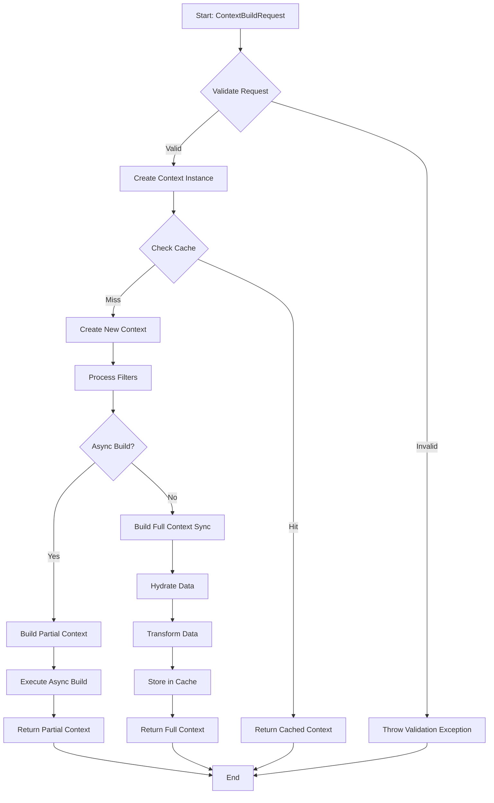
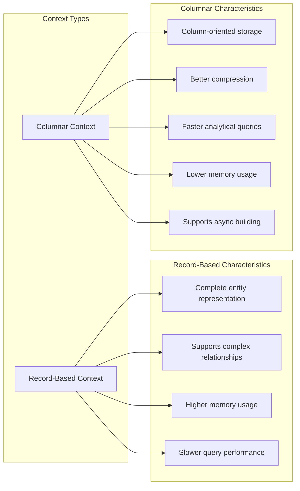
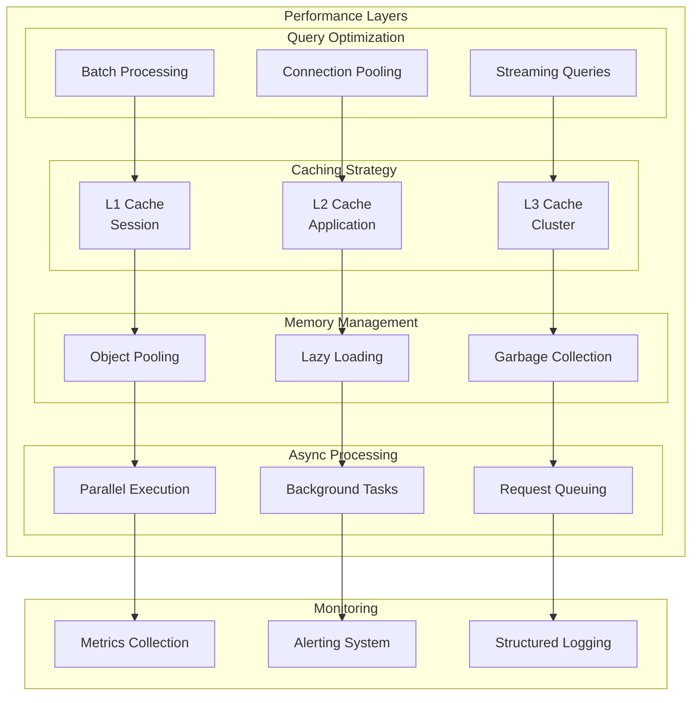
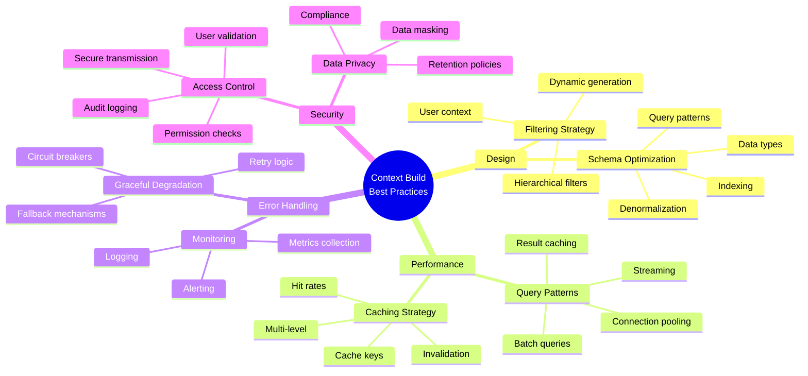
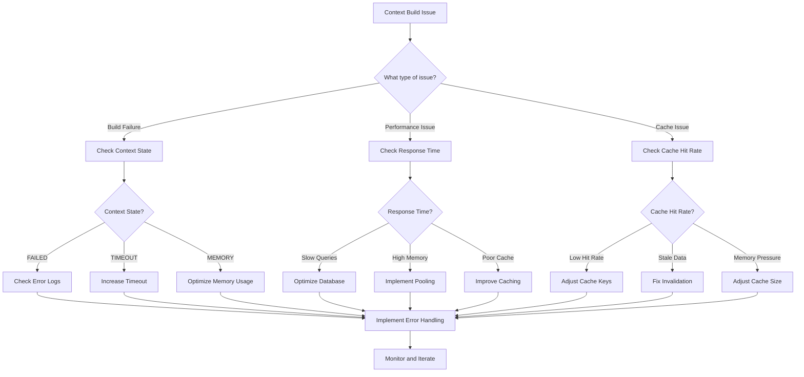
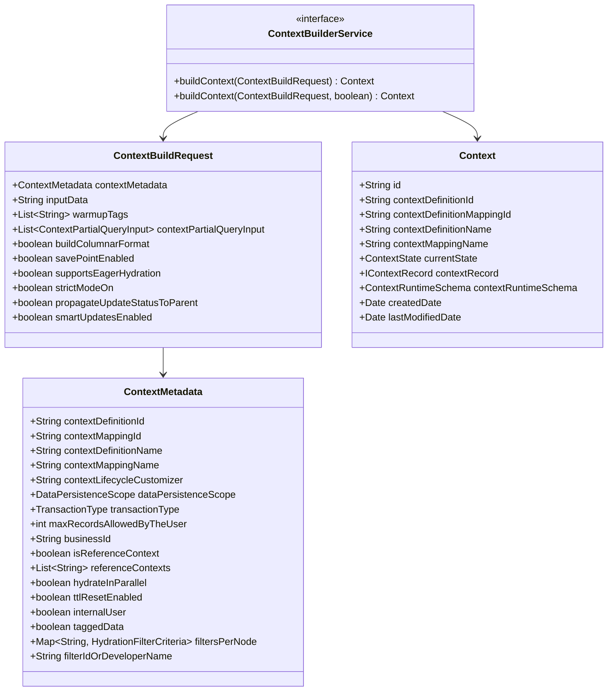

# Context Build Documentation

## Table of Contents
1. [Overview](#overview)
2. [Architecture](#architecture)
3. [Core Components](#core-components)
4. [Build Process](#build-process)
5. [Context Types](#context-types)
6. [Performance Considerations](#performance-considerations)
7. [Best Practices](#best-practices)
8. [Troubleshooting](#troubleshooting)
9. [API Reference](#api-reference)

## Overview

Context Build is a fundamental service in the Salesforce Industries platform that enables the creation and management of contextual data structures. It provides a flexible, scalable framework for building runtime contexts that can be used across various business processes, analytics, and AI applications.

### Key Features
- **Multi-format Support**: Supports both record-based and columnar data formats
- **Async Processing**: Enables both synchronous and asynchronous context building
- **Caching**: Multi-level caching for optimal performance
- **Filtering**: Advanced filtering capabilities during hydration
- **Persistence**: Multiple persistence scopes (Request, Session, Application)
- **TTL Management**: Configurable time-to-live with reset capabilities

## Architecture

### High-Level Architecture



### Component Interaction Flow



### Core Components

#### 1. ContextBuilderService
The main entry point for context building operations.

```java
public interface ContextBuilderService {
    Context buildContext(ContextBuildRequest contextBuildRequest) 
        throws ContextServiceAPIException;
    
    Context buildContext(ContextBuildRequest contextBuildRequest, boolean buildAsync) 
        throws ContextServiceAPIException;
}
```

#### 2. ContextBuilder
Abstract interface for different context building strategies.

```java
public interface ContextBuilder {
    void buildOrUpdateContext(String inputData, String lcCustomizer, 
                             Context context, boolean overwriteExistingRecords, 
                             boolean isTaggedData) throws ContextServiceAPIException;
    
    void buildPartialContext(String inputData, Context context, 
                            boolean overwriteExistingRecords, boolean isTaggedData,
                            Map<String, HydrationFilterCriteria> filtersPerNode, 
                            List<String> warmupTags, 
                            List<ContextPartialQueryInput> contextPartialQueryInput) 
        throws ContextServiceAPIException;
}
```

#### 3. ContextFactoryService
Responsible for creating and managing context instances.

## Build Process

### Build Process Flow



### 1. Request Validation
The build process begins with comprehensive validation:

```java
// Validate context definition and mapping IDs
if (IdUtil.isValidId(contextDefinitionId))
    IdValidationUtil.validateId(LOGGER, contextDefinitionId, ContextDefinitionUddConstants.EntityId);

// Validate permissions
validatePermissions(contextBuildRequest);

// Validate business rules
if (DataPersistenceScope.REQUEST.equals(contextBuildRequest.getContextMetadata().getDataPersistenceScope()) &&
    TransactionType.LARGECONTEXT.equals(contextBuildRequest.getContextMetadata().getTransactionType())) {
    ContextServiceDesignTimeLoggingAndMessagingUtil.logAndThrowRequestScopeNearCoreContextError(LOGGER);
}
```

### 2. Context Creation
A new context instance is created with appropriate metadata:

```java
Context context = contextFactoryService.get(
    contextDefinitionId, 
    contextMappingId,
    contextDefinitionName, 
    contextMappingName,
    contextBuildRequest.getContextMetadata().getDataPersistenceScope(),
    contextBuildRequest.getContextMetadata().getMaxRecordsAllowedByTheUser(),
    contextBuildRequest.isSavePointEnabled(),
    contextBuildRequest.isBuildColumnarFormat(),
    contextBuildRequest.supportsEagerHydration(),
    contextBuildRequest.isStrictModeOn(),
    contextBuildRequest.getContextMetadata().getBusinessId(),
    contextBuildRequest.getReferenceContexts(),
    contextBuildRequest.getContextMetadata().getIsReferenceContext(),
    contextBuildRequest.getContextMetadata().getTransactionType(),
    UserContext.get().getOrganizationId(),
    UserContext.get().getUserId(),
    contextBuildRequest.getContextMetadata().getHydrateInParallel(),
    contextBuildRequest.isPropagateUpdateStatusToParent(),
    contextBuildRequest.getContextMetadata().isTTLResetEnabled(),
    contextBuildRequest.isSmartUpdatesEnabled(),
    contextBuildRequest.getContextMetadata().isInternalUser(),
    lcCustomizer
);
```

### 3. Filter Processing
Filters are applied to control data hydration:

```java
Map<String, HydrationFilterCriteria> filtersPerNode = contextBuildRequest.getContextMetadata().getFiltersPerNode();
String filterIdOrDeveloperName = contextBuildRequest.getContextMetadata().getFilterIdOrDeveloperName();

if(MapUtils.isEmpty(filtersPerNode) && !StringUtils.isEmpty(filterIdOrDeveloperName)) {
    filtersPerNode = filterUtil.getFilterCriteriaMap(filterIdOrDeveloperName, contextDefinitionName, contextDefinitionId);
}
```

### 4. Build Execution
The actual context building occurs based on the format and async settings:

```java
if (buildAsync) {
    buildContextAsync(contextBuildRequest, context, inputData, filtersPerNode);
} else {
    buildOrUpdateContextInSync(inputData, context, true,
                               contextBuildRequest.getContextMetadata().isTaggedData(),
                               filtersPerNode, contextBuildRequest.getWarmupTags());
}
```

### 5. Async Build Process
For asynchronous builds, the process includes:

```java
private void buildContextAsync(ContextBuildRequest contextBuildRequest, Context context, 
                              String inputData, Map<String, HydrationFilterCriteria> filtersPerNode) {
    // Validate async build requirements
    if (DataPersistenceScope.REQUEST.equals(contextBuildRequest.getContextMetadata().getDataPersistenceScope())
        || !context.getContextRecord().isColumnar())
        ContextServiceDesignTimeLoggingAndMessagingUtil.logAndThrowPartialContextException(LOGGER);

    // Build partial context for immediate response
    columnBasedContextBuilder.buildPartialContext(inputData, context, true,
                                                  contextBuildRequest.getContextMetadata().isTaggedData(),
                                                  filtersPerNode, contextBuildRequest.getWarmupTags(),
                                                  contextBuildRequest.getContextPartialQueryInput());
    
    // Execute full build asynchronously
    asyncTasksExecutorUtil.executeBuildContext(() -> {
        fetchContextBuildRunnable(inputData, context.getId(), orgId, userId, true,
                                  contextBuildRequest.getContextMetadata().isTaggedData(),
                                  filtersPerNodeForAsyncThread, contextBuildRequest.getWarmupTags());
    });
}
```

## Context Types

### Context Type Comparison



### 1. Record-Based Context
Traditional context format where each entity is represented as a complete record.

**Characteristics:**
- Complete entity representation
- Supports complex relationships
- Higher memory usage
- Slower query performance for large datasets

**Use Cases:**
- Complex business logic requiring full entity access
- Small to medium datasets
- Development and testing scenarios

### 2. Columnar Context
Optimized format where data is stored in column-oriented structure.

**Characteristics:**
- Column-oriented storage
- Better compression
- Faster analytical queries
- Lower memory usage for large datasets
- Supports async building

**Use Cases:**
- Large-scale analytics
- High-performance querying
- Production environments with large datasets

## Performance Considerations

### Performance Optimization Architecture



### 1. Query Optimization

#### Batch Processing
```java
// Inefficient: N+1 query problem
for (String recordId : recordIds) {
    Entity[] result = contextDAO.fetchRecords("SELECT * FROM Account WHERE Id = '" + recordId + "'");
}

// Efficient: Batch query
String batchQuery = "SELECT * FROM Account WHERE Id IN (" + 
    recordIds.stream().map(id -> "'" + id + "'").collect(Collectors.joining(",")) + ")";
Entity[] batchResult = contextDAO.fetchRecords(batchQuery);
```

#### Connection Pooling
```java
@Component
public class OptimizedContextDAO {
    @Autowired
    private ConnectionPool connectionPool;
    
    public Entity[] fetchRecordsWithConnectionReuse(String query) {
        try (Connection conn = connectionPool.getConnection()) {
            return executeQueryWithConnection(conn, query);
        }
    }
}
```

### 2. Caching Strategy

#### Multi-Level Caching
```java
@Component
public class ContextServiceCacheManager {
    @Autowired
    private L1Cache l1Cache; // Session-scoped
    
    @Autowired 
    private L2Cache l2Cache; // Application-scoped
    
    @Autowired
    private DistributedCache l3Cache; // Cluster-scoped
    
    public <T> T getCachedContext(String key, Supplier<T> loader) {
        // Try L1 first
        T result = l1Cache.get(key);
        if (result != null) return result;
        
        // Try L2
        result = l2Cache.get(key);
        if (result != null) {
            l1Cache.put(key, result);
            return result;
        }
        
        // Try L3
        result = l3Cache.get(key);
        if (result != null) {
            l2Cache.put(key, result);
            l1Cache.put(key, result);
            return result;
        }
        
        // Load from source
        result = loader.get();
        l3Cache.put(key, result);
        l2Cache.put(key, result);
        l1Cache.put(key, result);
        return result;
    }
}
```

### 3. Memory Management

#### Object Pooling
```java
@Component
public class ContextObjectPool {
    private final Queue<CanvasContext> contextPool = new ConcurrentLinkedQueue<>();
    private final int maxPoolSize = 100;
    
    public CanvasContext borrowContext() {
        CanvasContext context = contextPool.poll();
        return context != null ? context : new CanvasContext();
    }
    
    public void returnContext(CanvasContext context) {
        if (contextPool.size() < maxPoolSize) {
            context.reset(); // Clear state
            contextPool.offer(context);
        }
    }
}
```

#### Lazy Loading
```java
public class LazyContextLoader {
    private final Supplier<HeavyContextObject> loader;
    private volatile HeavyContextObject cached;
    
    public HeavyContextObject get() {
        if (cached == null) {
            synchronized (this) {
                if (cached == null) {
                    cached = loader.get();
                }
            }
        }
        return cached;
    }
}
```

### 4. Async Processing

#### Parallel Context Building
```java
@Override
public CanvasContext get(CanvasLifecycleMap clm, Namespace namespace, String developerName, CanvasContext srcToCopyFrom) {
    CanvasContext rv = new CanvasContext();
    
    // Parallel execution of context building
    CompletableFuture<CanvasApplicationContext> appContextFuture = 
        CompletableFuture.supplyAsync(() -> getAppContext(clm, namespace, developerName, extractLocation(srcToCopyFrom)));
    
    CompletableFuture<CanvasUserContext> userContextFuture = 
        CompletableFuture.supplyAsync(() -> getUserContext());
    
    CompletableFuture<CanvasOrganizationContext> orgContextFuture = 
        CompletableFuture.supplyAsync(() -> getOrgContext());
    
    // Wait for all contexts to complete
    CompletableFuture.allOf(appContextFuture, userContextFuture, orgContextFuture).join();
    
    rv.setAppContext(appContextFuture.get());
    rv.setUserContext(userContextFuture.get());
    rv.setOrganizationContext(orgContextFuture.get());
    
    return rv;
}
```

## Best Practices

### Best Practices Framework



### 1. Context Design

#### Schema Optimization
- Design context schemas with query patterns in mind
- Use appropriate data types to minimize storage
- Consider denormalization for frequently accessed data
- Implement proper indexing strategies

#### Filtering Strategy
- Use filters to limit data hydration
- Implement hierarchical filtering
- Consider dynamic filter generation based on user context

### 2. Performance Optimization

#### Query Patterns
- Use batch queries instead of individual queries
- Implement proper connection pooling
- Use streaming for large result sets
- Consider query result caching

#### Caching Strategy
- Implement multi-level caching
- Use appropriate cache keys
- Implement proper cache invalidation
- Monitor cache hit rates

### 3. Error Handling

#### Graceful Degradation
```java
try {
    context = contextBuilder.buildContext(buildRequest);
} catch (ContextServiceAPIException e) {
    LOGGER.warn("Context build failed, using fallback: " + e.getMessage());
    context = getFallbackContext(buildRequest);
} catch (Exception e) {
    LOGGER.error("Unexpected error during context build: " + e.getMessage(), e);
    throw new ContextBuildException("Failed to build context", e);
}
```

#### Monitoring and Alerting
```java
@Component
public class ContextServiceMetrics {
    private final Timer queryTimer;
    private final Counter cacheHitCounter;
    private final Counter cacheMissCounter;
    
    public Timer.Sample startQueryTimer() {
        return Timer.start(meterRegistry);
    }
    
    public void recordCacheHit() {
        cacheHitCounter.increment();
    }
    
    public void recordCacheMiss() {
        cacheMissCounter.increment();
    }
}
```

### 4. Security Considerations

#### Access Control
- Implement proper permission checks
- Validate user context
- Use secure data transmission
- Implement audit logging

#### Data Privacy
- Implement data masking for sensitive information
- Use appropriate data retention policies
- Ensure compliance with privacy regulations

## Troubleshooting

### Troubleshooting Decision Tree



### Common Issues

#### 1. Context Build Failures

**Symptoms:**
- Context build requests failing
- Timeout errors
- Memory exhaustion

**Diagnosis:**
```java
// Check context state
if (context.getCurrentState() == ContextState.FAILED) {
    LOGGER.error("Context build failed for contextId: " + context.getId());
    // Check error logs for specific failure reason
}
```

**Solutions:**
- Increase timeout values
- Optimize query performance
- Implement proper error handling
- Use async building for large contexts

#### 2. Performance Issues

**Symptoms:**
- Slow context building
- High memory usage
- Poor cache hit rates

**Diagnosis:**
```java
// Monitor performance metrics
Timer.Sample sample = contextServiceMetrics.startQueryTimer();
try {
    // Perform context operation
} finally {
    sample.stop(contextServiceMetrics.getQueryTimer());
}
```

**Solutions:**
- Implement query optimization
- Use appropriate caching strategy
- Consider columnar format for large datasets
- Implement async processing

#### 3. Cache Issues

**Symptoms:**
- Low cache hit rates
- Stale data
- Memory pressure

**Diagnosis:**
```java
// Monitor cache metrics
long cacheHits = contextServiceMetrics.getCacheHitCounter().count();
long cacheMisses = contextServiceMetrics.getCacheMissCounter().count();
double hitRate = (double) cacheHits / (cacheHits + cacheMisses);
```

**Solutions:**
- Implement proper cache invalidation
- Use appropriate cache keys
- Consider multi-level caching
- Monitor cache size and eviction policies

### Debugging Tools

#### 1. Logging
```java
// Enable debug logging
LOGGER.debug("Context build started for contextId: %s, definitionId: %s", 
             contextId, contextDefinitionId);

// Log performance metrics
LOGGER.info("Context build completed in %d ms", buildDuration);
```

#### 2. Metrics
```java
// Track custom metrics
MeterRegistry meterRegistry = context.getMeterRegistry();
Timer.builder("context.build.duration")
    .tag("definition", contextDefinitionName)
    .tag("mapping", contextMappingName)
    .register(meterRegistry);
```

#### 3. Health Checks
```java
@Component
public class ContextServiceHealthIndicator implements HealthIndicator {
    @Override
    public Health health() {
        try {
            // Perform health check
            return Health.up()
                .withDetail("cache.status", "healthy")
                .withDetail("database.status", "connected")
                .build();
        } catch (Exception e) {
            return Health.down()
                .withDetail("error", e.getMessage())
                .build();
        }
    }
}
```

## API Reference

### API Structure



### ContextBuildRequest

```java
public class ContextBuildRequest {
    private ContextMetadata contextMetadata;
    private String inputData;
    private List<String> warmupTags;
    private List<ContextPartialQueryInput> contextPartialQueryInput;
    private boolean buildColumnarFormat;
    private boolean savePointEnabled;
    private boolean supportsEagerHydration;
    private boolean strictModeOn;
    private boolean propagateUpdateStatusToParent;
    private boolean smartUpdatesEnabled;
}
```

### ContextMetadata

```java
public class ContextMetadata {
    private String contextDefinitionId;
    private String contextMappingId;
    private String contextDefinitionName;
    private String contextMappingName;
    private String contextLifecycleCustomizer;
    private DataPersistenceScope dataPersistenceScope;
    private TransactionType transactionType;
    private int maxRecordsAllowedByTheUser;
    private String businessId;
    private boolean isReferenceContext;
    private List<String> referenceContexts;
    private boolean hydrateInParallel;
    private boolean ttlResetEnabled;
    private boolean internalUser;
    private boolean taggedData;
    private Map<String, HydrationFilterCriteria> filtersPerNode;
    private String filterIdOrDeveloperName;
}
```

### Context

```java
public class Context {
    private String id;
    private String contextDefinitionId;
    private String contextDefinitionMappingId;
    private String contextDefinitionName;
    private String contextMappingName;
    private ContextState currentState;
    private IContextRecord contextRecord;
    private ContextRuntimeSchema contextRuntimeSchema;
    private Date createdDate;
    private Date lastModifiedDate;
}
```

### Usage Examples

#### Basic Context Build
```java
ContextBuildRequest request = new ContextBuildRequest();
request.setContextMetadata(metadata);
request.setInputData(inputData);

Context context = contextBuilderService.buildContext(request);
```

#### Async Context Build
```java
ContextBuildRequest request = new ContextBuildRequest();
request.setContextMetadata(metadata);
request.setInputData(inputData);

Context context = contextBuilderService.buildContext(request, true);
```

#### Context with Filters
```java
ContextBuildRequest request = new ContextBuildRequest();
ContextMetadata metadata = new ContextMetadata();
metadata.setFiltersPerNode(filters);
request.setContextMetadata(metadata);
request.setInputData(inputData);

Context context = contextBuilderService.buildContext(request);
```

This documentation provides a comprehensive guide to understanding and working with the Context Build system in the Salesforce Industries platform. For additional information, refer to the specific implementation classes and test cases in the codebase.