# Salesforce Architecture Diagram

## Table of Contents
1. [Overview](#overview)
2. [High-Level Architecture](#high-level-architecture)
3. [Development & Deployment Flow](#development--deployment-flow)
4. [Falcon Integration](#falcon-integration)
5. [User Interaction Flow](#user-interaction-flow)
6. [Data Flow Architecture](#data-flow-architecture)
7. [Security & Authentication](#security--authentication)
8. [Multi-Tenant Architecture](#multi-tenant-architecture)

## Overview

Salesforce is a comprehensive cloud-based CRM platform that operates on a multi-tenant architecture. This document provides detailed architecture diagrams showing how different components interact, including the development pipeline, deployment processes, Falcon integration, and user interactions.

## High-Level Architecture

### Core Salesforce Platform Architecture

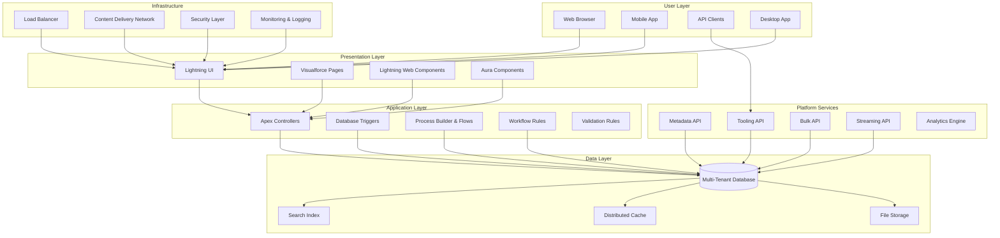

## Development & Deployment Flow

### Salesforce Development Pipeline

```mermaid
graph LR
    subgraph "Development Environment"
        IDE[IDE/Editor]
        LocalDev[Local Development]
        Sandbox[Developer Sandbox]
        Testing[Unit Testing]
    end
    
    subgraph "Version Control"
        Git[Git Repository]
        Branching[Feature Branches]
        CodeReview[Code Review]
        Merge[Merge Requests]
    end
    
    subgraph "Build & Test"
        CI[Continuous Integration]
        Build[Build Process]
        TestSuite[Test Suite]
        Quality[Code Quality Checks]
    end
    
    subgraph "Deployment"
        Staging[Staging Environment]
        UAT[User Acceptance Testing]
        Production[Production Deployment]
        Rollback[Rollback Mechanism]
    end
    
    subgraph "Monitoring"
        Logs[Logging]
        Metrics[Metrics Collection]
        Alerts[Alerting]
        Performance[Performance Monitoring]
    end
    
    IDE --> LocalDev
    LocalDev --> Sandbox
    Sandbox --> Testing
    
    Testing --> Git
    Git --> Branching
    Branching --> CodeReview
    CodeReview --> Merge
    
    Merge --> CI
    CI --> Build
    Build --> TestSuite
    TestSuite --> Quality
    
    Quality --> Staging
    Staging --> UAT
    UAT --> Production
    Production --> Rollback
    
    Production --> Logs
    Logs --> Metrics
    Metrics --> Alerts
    Alerts --> Performance
```

### Deployment Architecture

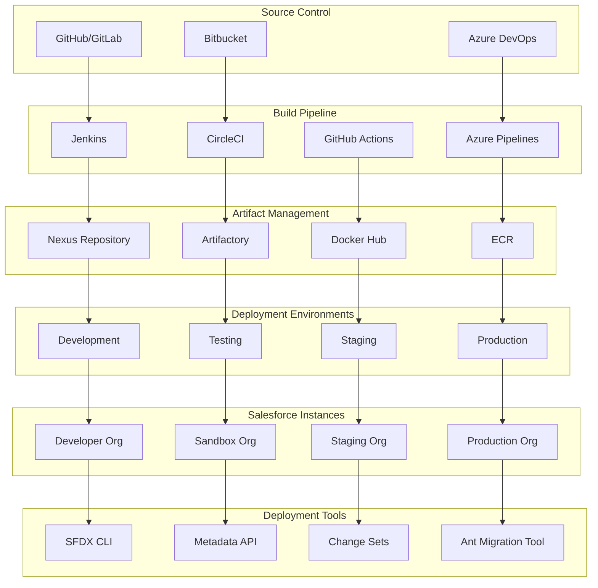

## Falcon Integration

### Falcon Architecture in Salesforce

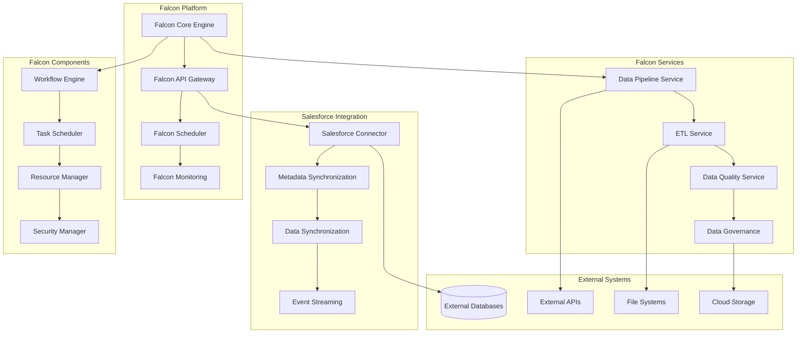

### Falcon-Salesforce Data Flow

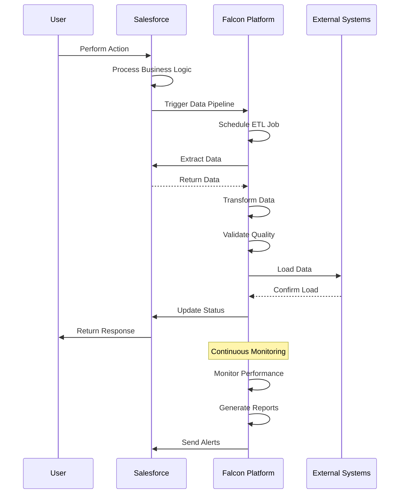

## User Interaction Flow

### End-to-End User Journey

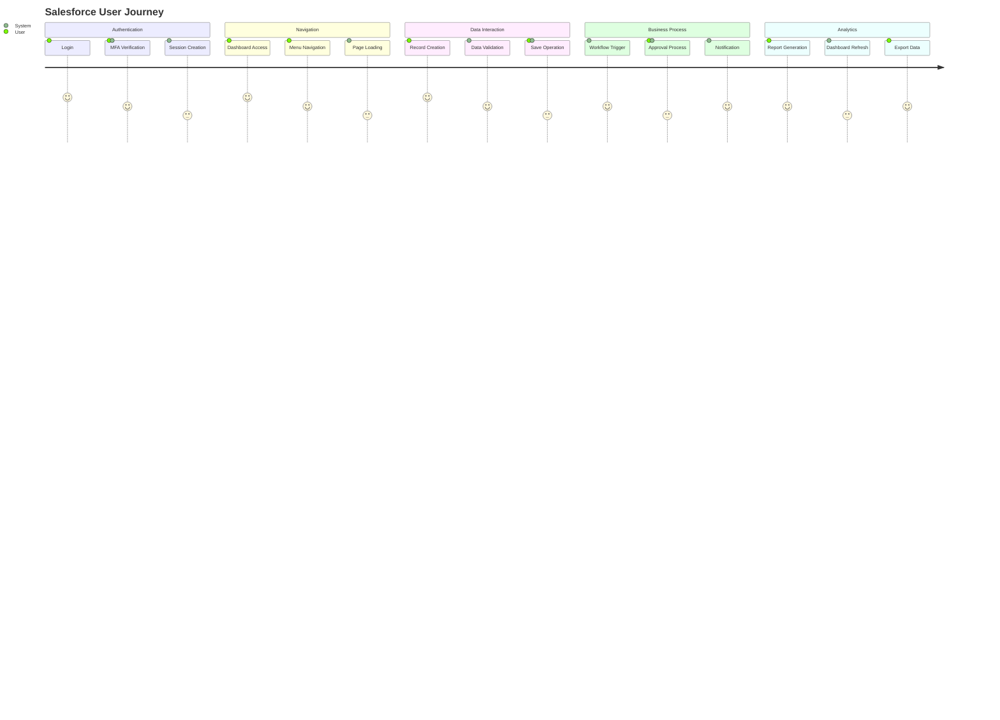

### User Interface Architecture

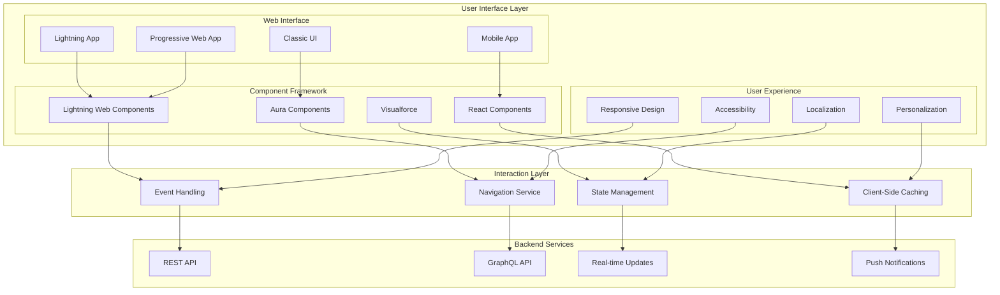

## Data Flow Architecture

### Salesforce Data Architecture

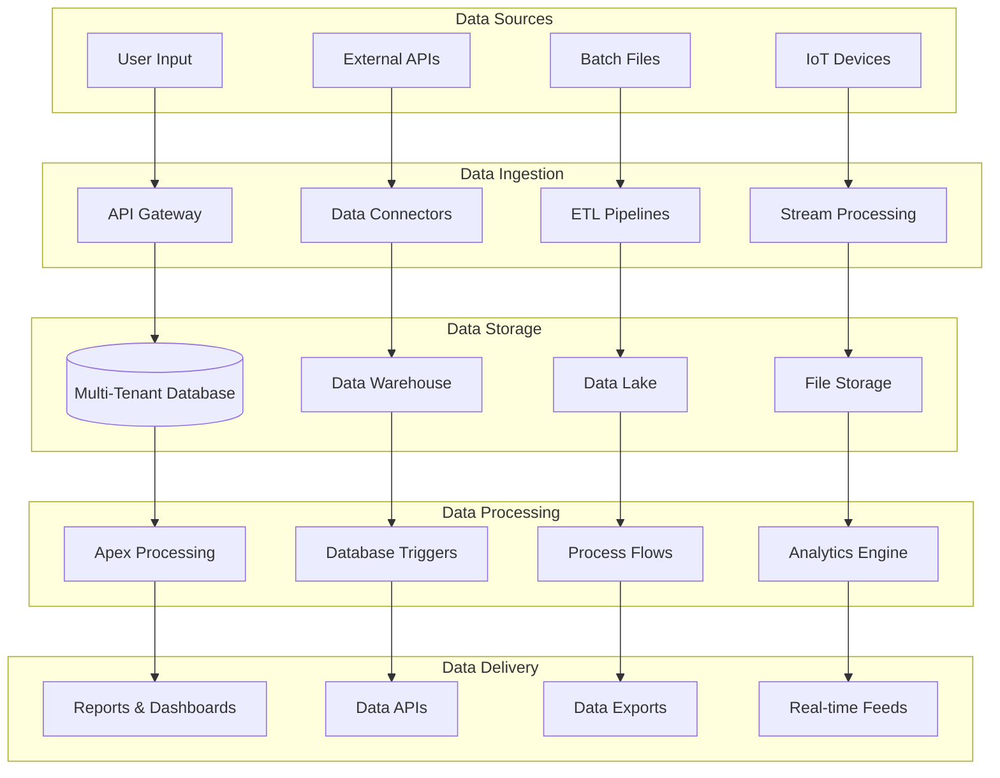

### Multi-Tenant Data Isolation

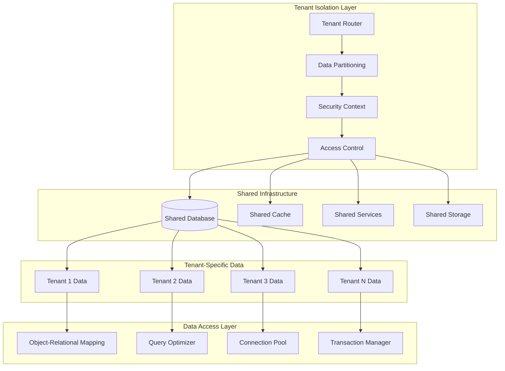

## Security & Authentication

### Salesforce Security Architecture

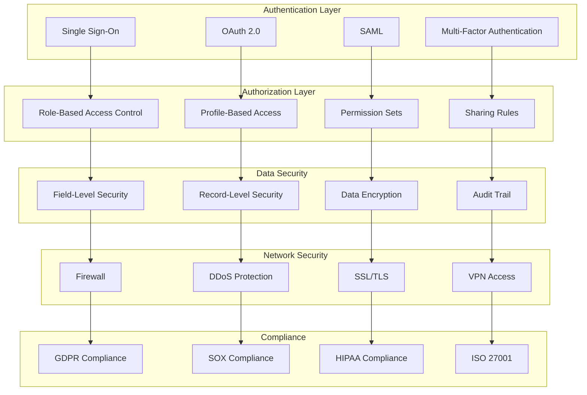

## Multi-Tenant Architecture

### Salesforce Multi-Tenant Model

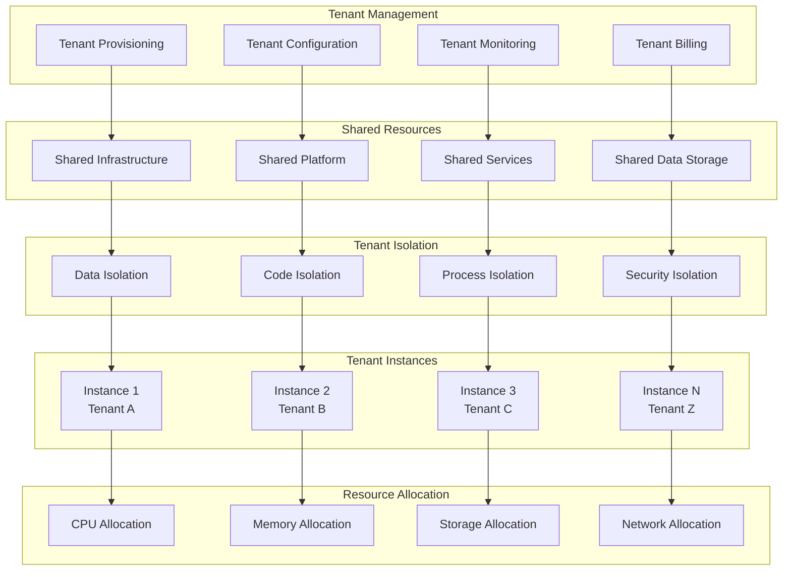

### Complete Salesforce Ecosystem

```mermaid
graph TB
    subgraph "Salesforce Ecosystem"
        subgraph "Core Platform"
            SalesCloud[Sales Cloud]
            ServiceCloud[Service Cloud]
            MarketingCloud[Marketing Cloud]
            CommerceCloud[Commerce Cloud]
        end
        
        subgraph "Development Platform"
            Platform[Force.com Platform]
            Heroku[Heroku]
            MuleSoft[MuleSoft]
            Tableau[Tableau]
        end
        
        subgraph "AI & Analytics"
            Einstein[Einstein AI]
            Analytics[Analytics Cloud]
            DataCloud[Data Cloud]
            AIStudio[AI Studio]
        end
        
        subgraph "Integration & APIs"
            RESTAPI[REST API]
            GraphQL[GraphQL API]
            BulkAPI[Bulk API]
            StreamingAPI[Streaming API]
        end
    end
    
    subgraph "External Integrations"
        CRMSystems[CRM Systems]
        ERPSystems[ERP Systems]
        MarketingTools[Marketing Tools]
        SocialMedia[Social Media]
    end
    
    subgraph "Development Tools"
        SFDX[SFDX CLI]
        VS Code[VS Code Extensions]
        Workbench[Workbench]
        Postman[Postman Collections]
    end
    
    subgraph "Deployment & DevOps"
        CI_CD[CI/CD Pipelines]
        ChangeSets[Change Sets]
        MetadataAPI[Metadata API]
        AntTool[Ant Migration Tool]
    end
    
    SalesCloud --> RESTAPI
    ServiceCloud --> GraphQL
    MarketingCloud --> BulkAPI
    CommerceCloud --> StreamingAPI
    
    Platform --> SFDX
    Heroku --> VS Code
    MuleSoft --> Workbench
    Tableau --> Postman
    
    Einstein --> CI_CD
    Analytics --> ChangeSets
    DataCloud --> MetadataAPI
    AIStudio --> AntTool
    
    RESTAPI --> CRMSystems
    GraphQL --> ERPSystems
    BulkAPI --> MarketingTools
    StreamingAPI --> SocialMedia
```

This comprehensive architecture diagram shows the complete Salesforce ecosystem, including:

- **Core Platform Components**: Sales Cloud, Service Cloud, Marketing Cloud, Commerce Cloud
- **Development & Deployment**: CI/CD pipelines, change sets, metadata API
- **Falcon Integration**: Data pipelines, ETL processes, monitoring
- **User Interactions**: Authentication, UI components, real-time updates
- **Data Architecture**: Multi-tenant database, data warehousing, analytics
- **Security**: Authentication, authorization, data encryption, compliance
- **Multi-Tenant Model**: Tenant isolation, resource allocation, shared services

The diagrams provide a clear understanding of how all these components work together to create the Salesforce platform.